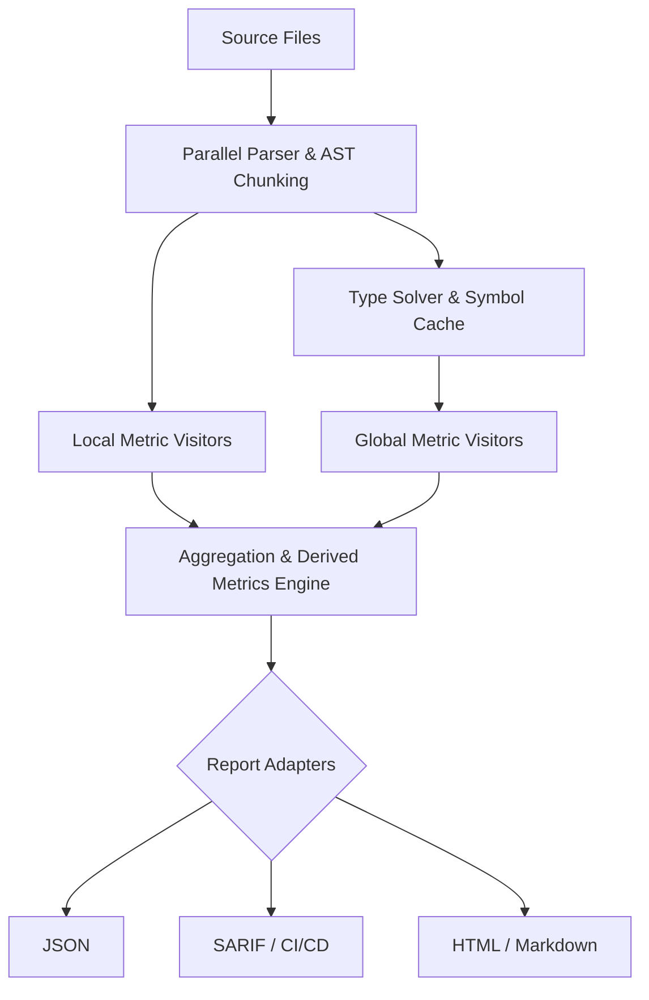

# Refactoring/Design Plan: Дорожная карта развития и рефакторинга MetricsTree CLI

## 1. Executive Summary & Goals
- **Основная цель:** Повысить точность вычисления метрик, оптимизировать потребление памяти на крупных кодовых базах и улучшить архитектуру для упрощения добавления новых метрик и интеграции с CI/CD.
- **Ключевые результаты:**
  1. Устранение "silent failures" при резолвинге символов JavaParser, что повысит точность метрик связности и связности (CBO, LCOM, ATFD).
  2. Снижение пикового потребления памяти (Heap) на 30-40% за счет оптимизации жизненного цикла AST и `TypeSolver`.
  3. Внедрение стандартизированных форматов отчетности (SARIF) и плагинной архитектуры для метрик.

## 2. Current Situation Analysis
- **Обзор системы:** MetricsTree — это зрелый multi-module Gradle-проект (Library + CLI) на Java 17. Использует JavaParser для AST и picocli для CLI. Поддерживает 40+ метрик, baseline-валидацию, исключения и обнаружение антипаттернов.
- **Ключевые проблемы и ограничения:**
  - **Точность метрик (Reliability):** Во многих визиторах (например, `JavaParserCouplingBetweenObjectsMetricVisitor`, `JavaParserLackOfCohesionOfMethodsMetricVisitor`) исключения при резолвинге символов глушатся (`catch (Exception ignored)`). Это приводит к занижению значений метрик на проектах со сложными зависимостями или при неполном classpath.
  - **Потребление памяти (Performance):** `EnhancedJavaParserContext` и `MemoryTypeSolver` загружают и хранят в памяти все `CompilationUnit` и их символы одновременно. При анализе крупных проектов (как Guava в `report.json`) это создает колоссальное давление на Garbage Collector и может приводить к OOM.
  - **Архитектурная связность (Maintainability):** Добавление новой метрики требует изменений в множестве мест: `MetricCode` enum, создание Visitor, регистрация в `JavaParserJavaMetricsAnalyzer`, обновление `DerivedMetricCalculator`.
  - **Сериализация:** `MetricReportJsonWriter` использует ручное маппинг на View-записи, что создает дублирование кода и усложняет поддержку.
  - **Форматы конфигурации:** Смешанное использование JSON (пороги, правила) и YAML (исключения), что когнитивно нагружает пользователя.

## 3. Proposed Solution / Refactoring Strategy

### 3.1. High-Level Design / Architectural Overview
Переход от монолитного конвейера анализа к модульному пайплайну с четким разделением на "локальные" (внутрифайловые) и "глобальные" (требующие графа всего проекта) метрики. Внедрение реестра метрик и стандартизация адаптеров вывода.

### 3.2. Key Components / Modules
- **`MetricRegistry` (Новый):** SPI/Реестр для декларативной регистрации метрик, их метаданных (уровень, описание, формула) и привязки к визиторам.
- **`AstMemoryManager` (Улучшение):** Компонент, управляющий высвобождением AST-деревьев сразу после извлечения локальных метрик, сохраняя только легковесные модели для глобального анализа.
- **`DiagnosticCollector` (Улучшение):** Централизованный сборщик проблем резолвинга, заменяющий `catch (Exception ignored)`.
- **`ReportAdapters` (Новый):** Стратегии для сериализации отчета (JSON, SARIF, SonarQube Generic Issue Data).

### 3.3. Detailed Action Plan / Phases

#### Phase 1: Reliability & Accuracy (Повышение точности)
- **Objective:** Устранить искажения метрик из-за нерезолвящихся символов.
- **Priority:** High
- **Task 1.1: Аудит и рефакторинг обработки исключений в визиторах**
  - **Rationale/Goal:** Заменить `catch (Exception ignored)` на логирование в `AnalysisDiagnostic` с кодом `UNRESOLVED_SYMBOL`. Это позволит пользователям видеть процент "покрытия" резолвинга и понимать, насколько точны метрики CBO, LCOM, RFC.
  - **Estimated Effort:** M
  - **Deliverable/Criteria for Completion:** Ни одного `ignored` исключения в `visitor.type` и `visitor.method`. Появление новых кодов ошибок в `AnalysisSeverity.WARNING`.
- **Task 1.2: Улучшение конфигурации `TypeSolver`**
  - **Rationale/Goal:** Текущий `MemoryTypeSolver` может конфликтовать при дубликатах классов. Добавить поддержку анализа `module-info.java` и улучшить fallback на `ReflectionTypeSolver`.
  - **Estimated Effort:** S
  - **Deliverable/Criteria for Completion:** Успешное разрешение символов для multi-module проектов без явного указания всех classpath-зависимостей.

#### Phase 2: Performance & Scalability (Оптимизация памяти)
- **Objective:** Снизить потребление памяти при анализе проектов >100k LOC.
- **Priority:** High
- **Task 2.1: Разделение метрик на Local и Global (Chunking)**
  - **Rationale/Goal:** Метрики вроде LOC, CC, Halstead не требуют знания о других классах. Их нужно вычислять во время парсинга и сразу удалять AST из памяти. Глобальные метрики (NOC, FDP, MOOD) вычисляются на втором проходе по легковесным "слепкам" (DependencySnapshot).
  - **Estimated Effort:** L
  - **Deliverable/Criteria for Completion:** Пиковое потребление памяти (Peak Heap) на Guava-подобных проектах снижается минимум на 30%.
- **Task 2.2: Оптимизация `ForkJoinPool` и потокобезопасности**
  - **Rationale/Goal:** Избежать contention при записи в общие словари и списки `diagnostics`. Использовать `ThreadLocal` или concurrent-коллекции с эффективным merge.
  - **Estimated Effort:** M
  - **Deliverable/Criteria for Completion:** Линейное масштабирование скорости анализа при увеличении количества ядер CPU.

#### Phase 3: Architecture & Extensibility (Рефакторинг ядра)
- **Objective:** Упростить добавление новых метрик и сериализацию.
- **Priority:** Medium
- **Task 3.1: Внедрение `MetricRegistry` и аннотаций**
  - **Rationale/Goal:** Избавиться от "божественного" класса `JavaParserJavaMetricsAnalyzer`, который явно инстанцирует 40+ визиторов. Метрики должны саморегистрироваться.
  - **Estimated Effort:** L
  - **Deliverable/Criteria for Completion:** Добавление новой метрики требует создания только одного класса-визитора и одной записи в реестре.
- **Task 3.2: Рефакторинг JSON-сериализации (Jackson Mixins)**
  - **Rationale/Goal:** Удалить ручные `*View` рекорды из `MetricReportJsonWriter`. Использовать Jackson Mixins или аннотации напрямую на доменных объектах `java-metrics-lib`.
  - **Estimated Effort:** M
  - **Deliverable/Criteria for Completion:** Удаление ~200 строк маппинг-кода, сохранение 100% обратной совместимости JSON-схемы.

#### Phase 4: Ecosystem & UX (Интеграция и форматы)
- **Objective:** Улучшить интеграцию с CI/CD и экосистемой.
- **Priority:** Medium
- **Task 4.1: Поддержка формата SARIF**
  - **Rationale/Goal:** SARIF — стандарт для GitHub Advanced Security, GitLab, SonarQube. Позволит автоматически создавать Issue/Alerts для антипаттернов (God Class, Data Class).
  - **Estimated Effort:** M
  - **Deliverable/Criteria for Completion:** Новый флаг `--format sarif` для команд `validate` и `detect`.
- **Task 4.2: Унификация форматов конфигурации**
  - **Rationale/Goal:** Перевести `exclusions.yml` на JSON (или добавить YAML-парсер для thresholds), чтобы пользователю не нужно было держать в голове два разных синтаксиса.
  - **Estimated Effort:** S
  - **Deliverable/Criteria for Completion:** Поддержка единого формата (например, JSON) для всех конфигов с сохранением обратной совместимости.

### 3.4. Data Model Changes
- Расширение `AnalysisDiagnostic`: добавление структурированных полей `unresolvedSymbolName` и `contextLocation`.
- Введение `MetricDefinition` (metadata: code, level, description, formula, dependencies).
- Добавление поля `resolutionCoverage` (процент успешно резолвящихся символов) в `ProjectReport` для оценки качества анализа.

### 3.5. API Design / Interface Changes
- **CLI:**
  - `analyze` / `validate` / `detect`: Добавление глобального флага `--format <json|sarif|html>` (дефолт: json).
  - Добавление флага `--verbose` для вывода подробных логов `TypeSolver` и пропущенных файлов.
- **Library API:**
  - Выделение интерфейса `MetricProvider` и `AstVisitor` для нужд плагина IntelliJ IDEA, чтобы IDE могла запрашивать метрики для конкретного файла без полного анализа проекта.

## 4. Key Considerations & Risk Mitigation

### 4.1. Technical Risks & Challenges
- **Риск:** Потеря точности глобальных метрик (NOC, FDP) при переходе на "chunking" (освобождение AST).
  - **Mitigation:** Тщательное проектирование `DependencySnapshot` (уже частично реализован в `AnalyzedClass`), который должен сохранять достаточно информации о типах, наследовании и вызовах методов для вычисления глобальных метрик на этапе агрегации.
- **Риск:** Breaking changes в JSON-отчетах при изменении сериализации.
  - **Mitigation:** Использование Jackson `@JsonAlias` и написание интеграционных тестов (snapshot testing) для проверки неизменности JSON-контракта.

### 4.2. Dependencies
- **JavaParser (3.25.10):** Библиотека `javaparser-symbol-solver-core` известна своими утечками памяти и багами при сложном наследовании. Требуется жесткий контроль версий и, возможно, написание кастомных патчей/оберток для `TypeSolver`.
- **IntelliJ Platform SDK:** Изменения в публичном API `java-metrics-lib` потребуют синхронного обновления кодовой базы IntelliJ IDEA плагина.

### 4.3. Non-Functional Requirements (NFRs) Addressed
- **Performance:** Chunking и оптимизация GC напрямую решают проблему масштабируемости на enterprise-репозиториях.
- **Reliability:** Устранение "silent catches" гарантирует, что метрики отражают реальное состояние кода, а не артефакты парсинга.
- **Maintainability:** `MetricRegistry` и Jackson Mixins снижают когнитивную нагрузку на разработчиков ядра.
- **Usability/Security:** Формат SARIF позволяет встроить MetricsTree в пайплайны Security/DevSecOps (GitHub Code Scanning).

## 5. Success Metrics / Validation Criteria
1. **Memory:** Peak Heap usage при анализе `guava-master` (или аналогичного проекта >500 классов) снижается на ≥30% по сравнению с текущим baseline.
2. **Accuracy:** В `report.json` появляется секция `diagnostics` с предупреждениями о нерезолвящихся символах; метрики CBO/LCOM для тестовых проектов с полным classpath совпадают с эталонными значениями (например, SonarQube/Understand).
3. **Extensibility:** Время onboarding нового разработчика для добавления простой метрики (например, "Number of Return Statements") сокращается до <30 минут.
4. **Integration:** SARIF-отчет успешно загружается в GitHub Advanced Security и отображает антипаттерны как Code Scanning Alerts.

## 6. Assumptions Made
- Предполагается, что пользователи CLI готовы к минорным изменениям в структуре `diagnostics` (добавление новых полей) при улучшении обработки ошибок.
- Метрики, требующие глобального графа наследования (NOC, некоторые MOOD метрики), могут быть вычислены только после полного парсинга всех файлов, что ограничивает степень "потоковости" (streaming) — мы будем хранить "слепки" (snapshots), а не полные AST.
- Плагин для IntelliJ IDEA имеет возможность обновляться синхронно с релизами `java-metrics-lib`.

## 7. Open Questions / Areas for Further Investigation
1. **Incremental Analysis:** Как реализовать инкрементальный анализ в CLI (файл `docs/prd/incremental-analisys.md` пуст), чтобы пересчитывать метрики только для измененных файлов в Git-репозитории? Требуется ли для этого кэширование `DependencySnapshot` на диск?
2. **Kotlin Support:** В `package-level-rules.json` есть правила для "Kotlin Data Class Anemia". Поддерживает ли текущий `JavaParserTypeSolver` смешанные Java/Kotlin проекты, или требуется интеграция с Kotlin Compiler API?
3. **Native Image:** Стоит ли компилировать CLI в GraalVM Native Image для ускорения cold-start в CI/CD пайплайнах, учитывая, что JavaParser и Reflection могут потребовать сложной конфигурации `reachability-metadata.json`?
